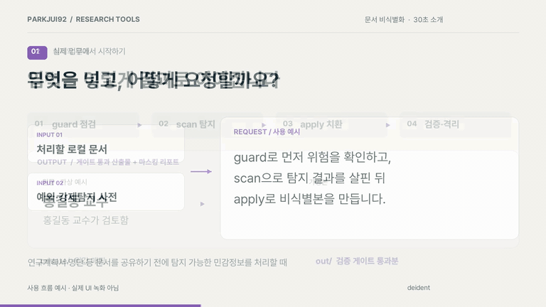

# deident — 문서 민감정보 비식별화

**문서 속 이름·기관 등 민감정보를 찾아 가명으로 바꾸고, 결과를 재검사하는 로컬 실행 도구입니다.**

예를 들어 문서에 두 번 나온 `홍길동 교수`를 두 곳 모두 `[연구자A] 교수`로 바꿉니다. 탐지·치환에 외부 API를 사용하지 않으며, 검증 게이트를 통과한 파일만 `out/`에 둡니다. HWPX·워드·엑셀·발표자료는 서식을 보존하는 방식으로 처리하고, PDF는 내용 제거, 구형 HWP는 텍스트 추출 경로를 씁니다.

## 30초 소개

[](docs/media/intro.mp4)

*가상 문서로 실제 실행한 명령·출력을 재생한 30초 영상입니다. 이름·기관을 사전에 등록한 예제입니다.*

## 실제로는 이렇게 씁니다

**예: 연구책임자 이름과 소속이 들어 있는 문서를 공유하기 전.** 원본은 `intro-work/in/`, 이름·기관을 지정한 사전은 `intro-work/config/`에 둡니다. 아래 [가상 문서 실행 예제](#가상-문서로-처음-실행하기)로 준비할 수 있습니다.

```bash
python3 run.py --root intro-work scan   # 탐지 결과 확인
python3 run.py --root intro-work apply  # 가명 치환 → 재검사
```

이번 가상 문서를 실제 실행한 결과입니다. 이름·기관을 사용자 사전에 명시했으므로 **자동 탐지 성능이 아닌 치환·검증 흐름**을 보여줍니다.

```text
탐지 3건: 성명 2건, 기관 1건
게이트: 통과 (재탐지 0, 원값 잔존 0)
산출: intro-demo.비식별.md
```

| 원본 문서 | 실제 산출물 |
|---|---|
| 연구책임자: 홍길동 교수 | 연구책임자: [연구자A] 교수 |
| 소속: 미래정책연구원 | 소속: [기관A] |
| 홍길동 교수가 검토함. | [연구자A] 교수가 검토함. |

**확인할 결과:** `intro-work/out/intro-demo.비식별.md`를 열어 치환 상태를 확인합니다. 원값↔가명 매핑은 `intro-work/_private/mapping.json`에 별도로 남습니다.

**차별점:** 탐지·치환을 로컬에서 수행하고, 같은 인물은 같은 가명으로 바꾸며, 검증 게이트 불합격 결과를 격리합니다. 게이트 통과가 탐지 누락이나 문맥에 의한 재식별까지 없다는 뜻은 아니므로 공유 전 결과를 직접 확인하세요.

## 왜 이렇게 만들었나

문서를 AI에 넣기 전에 개인정보를 지우려는데, **지우는 과정에서 AI가 원문을 읽으면**
아무 의미가 없다. 그래서 탐지·치환을 전부 로컬 파이썬 코드에 두고, AI(또는 사람)가
보는 것은 `홍*동` 식으로 가려진 요약만 되게 했다.

안전을 규율이 아니라 **구조**로 보장하는 네 가지 불변식:

1. **LLM 원문 격리** — 탐지·치환은 100% 로컬. 요약에는 마스킹된 값만 실린다.
2. **out/ 불변식** — 검증 게이트를 통과한 파일만 `out/`에 존재한다. 하나라도
   불합격이면 그 실행의 산출물 전부를 격리한다. 부분 통과는 없다.
3. **매핑 격리** — 원값↔가명 매핑과 원문 대조 리포트는 `_private/`(권한 700)에만.
4. **stdout 위생** — 트레이스백에 원문 조각이 섞이지 않게, 전문은 로그 파일로만.

---

## 설치

파이썬 3.11 이상. 표준 라이브러리 + 아래 선택 의존성.

```bash
git clone https://github.com/parkjui92/deident.git
cd deident
pip install lxml pyyaml            # 필수
pip install kiwipiepy              # 한국어 인명 탐지 (권장)
pip install pymupdf openpyxl olefile  # PDF·엑셀·구형 한글
```

없는 라이브러리에 딸린 기능만 조용히 빠지고 나머지는 그대로 돈다.

```bash
mkdir -p work/in work/config
cp config.example/* work/config/   # 작업 폴더 준비
python3 run.py --root work guard "work/in/문서.hwpx"
```

### 가상 문서로 처음 실행하기

설치 후 저장소 폴더에서 실행합니다. 아래 연습은 새 `intro-work/` 폴더를 만들며,
사전에 이름·기관을 명시해 **탐지 성능이 아닌 치환·검증 흐름**을 확인합니다.

```bash
mkdir -p intro-work/in intro-work/config
cp config.example/* intro-work/config/
cp examples/intro-demo.md intro-work/in/
printf '\n홍길동,person\n미래정책연구원,org\n' >> intro-work/config/denylist.txt
python3 run.py --root intro-work apply intro-work/in/intro-demo.md
```

`intro-work/out/intro-demo.비식별.md`에서 `홍길동 교수`가 `[연구자A] 교수`로 바뀌고,
다시 나오는 이름도 같은 가명인지 확인하세요. 실제 문서를 처리할 때는 자동 탐지 결과와
사용자 사전을 함께 점검합니다. `intro-work/`의 원문·매핑 파일은 저장소에 커밋하지 않습니다.

---

## 사용

```bash
python3 run.py guard "문서.hwpx"    # ① 열기 전 점검 (읽기 전용)
python3 run.py scan  "문서.hwpx"    # ② 무엇이 얼마나 잡히나 (파일 변경 없음)
python3 run.py apply "문서.hwpx"    # ③ 비식별본 생성 + 검증 게이트
```

작업 폴더는 `--root` 또는 환경변수 `DEIDENT_ROOT`, 없으면 현재 폴더.

| 명령 | 하는 일 | 종료 코드 |
|---|---|---|
| `guard` | 위험도만 빠르게 판정 | 0 없음·참고 / 3 주의 이상 **또는 검사 불가** |
| `scan` | 탐지 + 리포트 | 0 |
| `apply` | 탐지 → 치환 → 위생 → 게이트 → 리포트 | 0 통과 / 2 게이트 불합격 |
| `verify` | 산출물만 재검증 | 0 / 2 |
| `restore` | 가명 → 원값 (`_private/restored/`에만) | 0 |
| `selftest` | 합성 문서로 탐지 재현율 확인 | 0 통과 / 2 놓침 |

옵션: `--strict-only`(확실 등급만) · `--mask`(●●●, 복원 불가) · `--quick`(guard 빠른 검사)

### 폴더

```
in/         원문
out/        ★ 게이트를 통과한 산출물만 여기 온다
_private/   원값이 있는 유일한 구역 (700)
  mapping.json · *.report_full.html · failed/ · restored/ · logs/
config/     allowlist.txt · denylist.txt · settings.yaml · confidential_rules.yaml
```

---

## 어떻게 찾는가

| 계층 | 방법 | 잡는 것 |
|---|---|---|
| **L1** | 정규식 + 검증식 | 주민등록번호·외국인등록번호·여권·면허·전화·이메일·카드·계좌·사업자/법인번호·차량·주소·생년월일 |
| **L2** | 문서 구조 (주력) | 표 머리글(`성명`·`소속`·`생년월일`)이 지목한 칸의 값을 건져 대장에 올리고 문서 전체로 전파 |
| **L3** | 형태소 + 접미사 | 표 밖의 이름(kiwipiepy), 기관 접미사(`~연구원`·`~대학교`) |
| 사전 | 사용자 지정 | `denylist`(강제 탐지)·`allowlist`(예외)·`confidential_rules`(과제번호·예산·기밀어) |

**이름은 L2가 주력이다.** 형태소 분석기는 사전에 없는 이름을 쪼갠다(`박서준` → 박/서/준).
표에서 확실하게 건진 이름을 사전에 등록한 뒤 전파하는 편이 훨씬 정확하다.

**체크섬은 탈락 근거가 아니다.** 2020년 10월 이후 발급된 주민등록번호는 뒷자리가
무작위여서 옛 검증식을 통과하지 않는다. 검증식으로 걸러 내면 최신 번호를 통째로 놓친다.

**마무리 훑기.** 한 번 민감하다고 판정한 값은 문맥이 없는 자리에서도 지운다 —
자간을 벌려 쓴 표기(`한 국 화 학`), 앞뒤에 글자가 붙은 자리(`발표자홍길동`),
줄바꿈이 끼어든 이름, 도형 이름·대체 텍스트 같은 XML 속성까지. 전부 실문서에서
실제로 남았던 자리다.

---

## 포맷

| 형식 | 서식 보존 | 비고 |
|---|---|---|
| `.hwpx` | ○ | 표·글상자·머리말·각주·바탕쪽. 조판 캐시·미리보기(PrvText)·문서이력(DocHistory)·첨부 파일명·작성자 메타 소거 |
| `.docx` | ○ | 머리말·꼬리말·각주·글상자(Choice/Fallback 양쪽). 메모·people.xml 제거. **변경 추적이 켜져 있으면 거부** |
| `.pptx` | ○ | 슬라이드 + **발표자 노트** |
| `.xlsx` | ○ | 공유 문자열을 직접 고쳐 수식·서식·차트 보존 |
| `.csv` `.md` `.txt` `.html` `.json` | ○ | 줄 모양 유지 |
| `.pdf` | 레댁션만 | 검은 칸으로 덮는다(비증분 저장으로 구버전 객체까지 회수). 가명본은 함께 나오는 `.md` 사용 |
| `.hwp` (구형) | ✕ | 텍스트 추출 → 마크다운만. 서식 사본은 한글에서 `.hwpx`로 저장 후 재실행 |

---

## 무엇을 보증하고, 무엇을 보증하지 못하는가

게이트가 보증하는 것은 **둘뿐이다**.

1. 탐지된 값은 산출물에서 제거됐다 (같은 조이너·같은 탐지기로 재검사)
2. 매핑에 오른 원값은 산출물 어디에도 없다 (zip 전 멤버·원시 바이트·NFC/NFD·
   숫자 흐름까지 훑는다)

보증하지 **못하는** 것:

- **애초에 탐지가 놓친 값** — 규칙 기반 탐지기의 재실행은 같은 것을 다시 놓친다
- **이미지 속 글자** — 도장·서명·조직도 캡처·스캔 PDF
- **문맥 재식별** — "국내 유일 ○○ 보유 대학"은 이름 없이도 특정된다 (경고만 표시)
- **표 구조가 남기는 정보** — 행 수가 곧 인원 수

그래서 마지막 확인은 사람이 한다. `out/*.report.html`(마스킹)로 전체를 보고,
값 대조가 필요하면 `_private/*.report_full.html`(원문 포함)을 연다.

**검사하지 못한 것을 "없음"이라 말하지 않는다.** 미지원 형식·열기 실패는
'확인 필요'로 따로 표기한다 — 이 도구가 저지를 수 있는 가장 나쁜 거짓말은 거짓 안심이다.

---

## 오탐·누락 고치기

문서를 직접 손대지 말고 사전에 한 줄 넣고 다시 실행한다.

| 증상 | 파일 | 적는 법 |
|---|---|---|
| 가리면 안 될 말이 가려짐 | `config/allowlist.txt` | `라만` |
| 가려야 할 것이 안 잡힘 | `config/denylist.txt` | `미래소재연구단,org` |
| 특정 구분을 통째로 끄기 | `config/settings.yaml` | `categories: {org: false}` |
| 추정 등급 치환이 과함 | 실행 옵션 | `--strict-only` |

---

## 개발

```bash
python3 -m pytest tests/ -q
python3 run.py selftest
```

테스트에 실제 개인정보를 쓰지 않는다. `tests/synth.py`가 형태만 유효한 허구 값
(검증식만 만족하는 주민등록번호 등)을 만든다.

구조: `extract/`(포맷별 추출) → `detect/`(L1·L2·L3) → `entity/`(대장·가명) →
`apply/`(치환·마무리 훑기·위생) → `verify/`(재스캔·전수 탐색·게이트) → `report/`.
공용 규약은 `model.py`, 공용 치환 엔진은 `apply/xml_apply.py`.

한 문장이 여러 노드로 쪼개져 저장되는 것이 한글·워드의 기본값이라
(`<t>홍길</t><t>동</t>`), 탐지는 이어 붙인 문자열에서 하고 치환은 그 오프셋을
다시 노드 위치로 되돌린다. 탭·줄바꿈은 넘을 수 없는 경계로 심어 둔다.

## 라이선스

MIT
